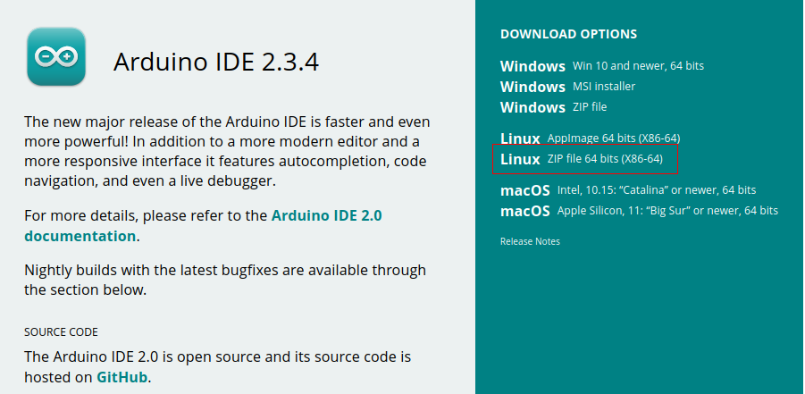
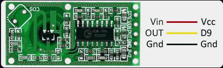
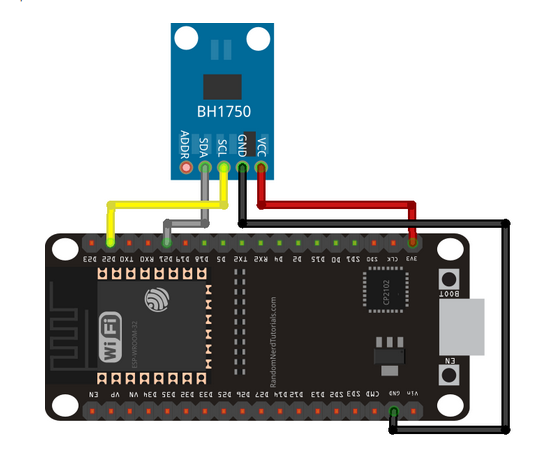
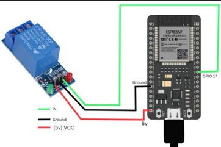

# Dispositivo Domótico de Detección de Movimiento

## 1. Introducción

Este proyecto tiene como objetivo desarrollar un dispositivo domótico capaz de detectar movimiento y controlar el encendido y apagado de luces de manera automatizada. Utilizando sensores de movimiento, el sistema activará las luces cuando se detecte presencia en la zona monitoreada. Si no se detecta movimiento durante un periodo de tiempo determinado, el dispositivo apagará automáticamente las luces para optimizar el consumo energético y mejorar la eficiencia del sistema.

### Objetivo:

El sistema busca optimizar el consumo de energía, asegurándose de que las luces solo se enciendan cuando realmente se necesiten (cuando la luz es insuficiente y hay personas en el aula), y se apaguen automáticamente cuando no haya nadie o cuando la luz ambiental sea suficiente para la actividad.

## 2. Materiales Necesarios

- ESP32
- Cables de conectividad
- Relé
- Sensor de luz
- Sensor de movimiento por microondas
- Cable USB

## 3. Instalación del Entorno de Desarrollo

Para programar el ESP32, es necesario instalar el Arduino IDE. Sigue estos pasos para descargarlo e instalarlo:

1. Accede al sitio web oficial de Arduino: [Arduino IDE](https://www.arduino.cc/en/software).
2. Selecciona la versión correspondiente a tu sistema operativo (Windows, macOS o Linux).
   en nuestro caso cogemos el Archivo exportable de la version de linux que sale en la imagen
   

3. Descarga el archivo de instalación y ejecúta el programa.

## 3. Instalación de Sensor de Movimiento microondas

Una vez instalador del entorno de desarrollo ya podemos programar nuestra esp32 con lo sensores correspondientes, empezaremos con el sensor de movimiento Microondas

Los sensores de microondas usan ondas electromagnéticas para detectar objetos o movimientos, sin necesidad de contacto. Funcionan analizando cómo las ondas rebotan o cambian al interactuar con algo. Son muy útiles porque pueden detectar cosas a través de materiales como plástico y madera, y funcionan bien en ambientes difíciles (como con polvo o humedad). Sin embargo, pueden ser más caros que otros sensores y pueden tener problemas con **interferencias**.

### Conectividad con ESP32

| **Conexión** | **Descripción**                 |
| ------------ | ------------------------------- |
| **VIN**      | Vcc                             |
| **OUT**      | Cualquier puerto de información |
| **GND**      | GND                             |

**Codigo de ejemplo para comprobar su funcionamiento**
[Enlace](./Codigos/programaSensorMicroondas.ino)

## 4. Instalación de Sensor de Luz

Los sensores de luz detectan la cantidad de luz ambiental y la convierten en una señal eléctrica. Los tipos más comunes incluyen LDR, fotodiodos y fototransistores, cada uno con sus características de sensibilidad. Son útiles para automatizar procesos y ahorrar energía, ya que ajustan el uso de luz artificial. Sin embargo, su rendimiento puede verse afectado por factores como la temperatura o la calidad de la luz, y algunos tienen un rango limitado de detección.

### Conectividad con ESP32

| **Conexión** | **Descripción**                |
| ------------ | ------------------------------ |
| **SCL**      | GPIO 22                        |
| **SDA**      | GPIO 21                        |
| **VCC**      | Atribuye el sensor (3.3V o 5V) |
| **GND**      | GND común                      |

**Codigo de ejemplo para comprobar su funcionamiento**
[Enlace](./Codigos/programillaLuzPrueba.ino)

## 5. Instalación de Relé

Pasamos a la instalación del relé para cuando los sensores anteriores cumplan su funcionalidad el rele se active o desactive

### Conectividad con ESP32

| **Conexión** | **Descripción**                |
| ------------ | ------------------------------ |
| **IN**       | GPIO 21 (o cualquier GPIO)     |
| **GND**      | GND común                      |
| **VCC**      | Atribuye el sensor (3.3V o 5V) |

**Codigo de ejemplo para comprobar su funcionamiento**
[Enlace](./Codigos/programaRele.ino)

## Sistema de Control Automático de Luces

Este sistema automatiza el encendido y apagado de las luces en un aula utilizando un **sensor de luz** y un **sensor de movimiento**. El funcionamiento del sistema depende de dos condiciones principales: la cantidad de luz en el aula y la presencia de personas.

### Funcionamiento:

1. **Medición de la luz en el aula**:

   - El **sensor de luz** mide la cantidad de luz que entra en el aula. Si la luminosidad es insuficiente (por ejemplo, si está oscuro o la luz natural es baja), el sistema se activará para verificar si hay personas en la habitación.

2. **Detección de presencia**:

   - El **sensor de movimiento** detecta si hay personas en el aula. Si el sensor de movimiento detecta presencia y la luminosidad es baja, el sistema activa el **relé** para encender las luces.

3. **Condiciones para encender las luces**:

   - Si el sensor de luz detecta que la luminosidad es baja y el sensor de movimiento detecta presencia, el **relé** se activa y las luces se encienden.

4. **Condiciones para apagar las luces**:

   - Si no se detecta movimiento (no hay personas en el aula), las luces se apagan.
   - Si el sensor de luz detecta que la luminosidad es suficiente (por ejemplo, si hay luz natural o artificial suficiente para ver), las luces no se encenderán, incluso si el sensor de movimiento detecta presencia.

   - tendremos que tener conectado todos los sensores

**Codigo de ejemplo para comprobar su funcionamiento**
[Enlace](./Codigos/programaLuzYMovimiento.ino)
